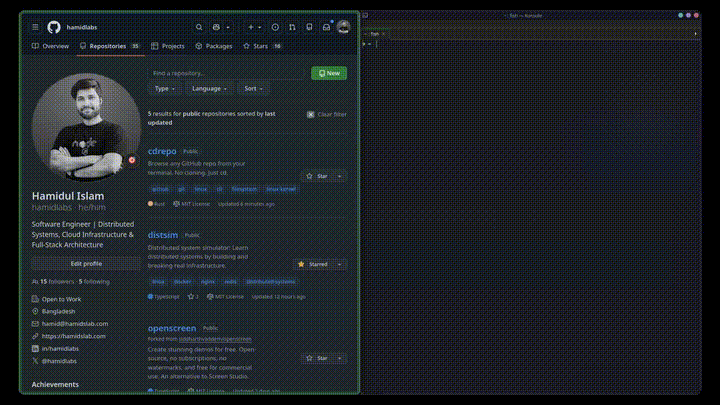

<div align="center">

# cdrepo

**Browse any GitHub repo from your terminal. No cloning.**

`cd` into a repo link. That's it.

[](LICENSE)
[](https://www.rust-lang.org/)
[](https://github.com/hamidlabs/cdrepo/releases)

<br>



[Watch full demo](https://github.com/hamidlabs/cdrepo/blob/main/.github/assets/demo.mp4)

<br>

```
cd https://github.com/torvalds/linux
ls
cat Makefile
```

</div>

---

## The Story

While working on a project, I constantly needed to peek at code from other repos — check an API signature, read a config file, understand how a library structures things. Every single time, the workflow was the same: open browser, navigate to GitHub, find the file, read it there. Or worse — clone the entire repo just to read one file, then delete it later.

I never wanted to leave my terminal. What if I could just `cd` into a repo link and browse it like a local directory?

So I built **cdrepo**.

---

## Features

- **Just `cd` a link** — HTTPS, SSH, `github.com/owner/repo`, or just `owner/repo`
- **Zero config** — one install command sets up everything
- **Private repos** — uses your existing `gh` auth, no extra tokens
- **Fast** — entire repo tree fetched in a single API call, files loaded lazily
- **Cached** — content-addressable cache (SHA-keyed), same content never downloaded twice
- **Real filesystem** — `ls`, `cat`, `grep`, `vim`, `tree` all work out of the box
- **Smart `cd ..`** — navigates within the repo, exits back to your original directory at the root
- **Auto-recovery** — stale mounts are detected and remounted transparently
- **Multi-shell** — bash, zsh, and fish supported automatically

## Quick Start

```bash
git clone https://github.com/hamidlabs/cdrepo.git
cd cdrepo
./install.sh
```

Restart your shell. Done.

```bash
cd https://github.com/antonmedv/fx    # paste any repo link
cd cli/cli                             # or just owner/repo
cd git@github.com:user/repo.git        # ssh works too
```

<details>
<summary><b>Requirements</b></summary>

- **Rust** — for building from source
- **FUSE** — `fuse3` on Linux, `macFUSE` on macOS
- **GitHub CLI** (`gh`) — for authentication

</details>

<details>
<summary><b>What the installer does</b></summary>

1. Builds the `cdrepo` binary (release mode, optimized with LTO)
2. Installs to `~/.cdrepo/bin/`
3. Adds PATH for all detected shells (bash, zsh, fish)
4. Injects `cd` shell hook
5. Verifies FUSE availability
6. Verifies GitHub authentication

No manual configuration. No editing dotfiles.

</details>

## Usage

```bash
# HTTPS URL — just paste from your browser
cd https://github.com/rust-lang/rust

# Short form
cd github.com/cli/cli

# Just owner/repo
cd cli/cli

# SSH format
cd git@github.com:user/private-repo.git

# Browse normally — ls, cat, grep, vim all just work

# cd .. at repo root returns you to where you were

# Manage
cdrepo list              # show mounted repos
cdrepo unmount cli/cli   # manually unmount
cdrepo clear-cache       # clear file cache
cdrepo auth              # check auth status
```

### Supported Formats

| Format | Example |
|--------|---------|
| HTTPS | `cd https://github.com/owner/repo` |
| Short | `cd github.com/owner/repo` |
| Owner/Repo | `cd cli/cli` |
| SSH | `cd git@github.com:owner/repo.git` |
| Branch | `cd https://github.com/owner/repo/tree/develop` |
| Path | `cd https://github.com/owner/repo/tree/main/src` |

## How It Works

```
  cd https://github.com/user/repo
               │
               ▼
     ┌───────────────────┐
     │    Shell Hook      │  fish/bash/zsh intercepts cd,
     │    (cd override)   │  detects GitHub URL pattern
     └─────────┬─────────┘
               │
               ▼
     ┌───────────────────┐
     │   cdrepo mount     │  spawns background daemon
     └─────────┬─────────┘
               │
               ▼
     ┌───────────────────┐       ┌────────────────────┐
     │   cdrepo daemon    │──────▶  GitHub REST API    │
     │   (background)     │       │  (authenticated)   │
     └─────────┬─────────┘       └────────────────────┘
               │
               │  1. Fetch entire tree (single API call)
               │  2. Fetch file content on demand
               │
               ▼
     ┌───────────────────┐
     │    FUSE Mount      │  ~/.cdrepo/mnt/owner/repo/
     │    (read-only)     │
     └─────────┬─────────┘
               │
               ▼
         Normal shell
      ls, cat, grep, vim
        all just work
```

<details>
<summary><b>Design Decisions</b></summary>

**FUSE over custom TUI** — By mounting a real filesystem, every existing tool works: `grep -r`, `vim`, `tree`, `wc -l`. No special commands to learn.

**Blocking HTTP in FUSE daemon** — The daemon uses `reqwest::blocking` instead of async. FUSE callbacks are synchronous, and mixing async runtimes with `fork()` causes deadlocks.

**Spawn, don't fork** — The `mount` command spawns `cdrepo daemon` as a clean separate process. `fork()` breaks tokio's runtime threads in the child, causing terminal hangs on file reads.

**SHA-keyed cache** — Git objects are immutable. A blob SHA always maps to the same content. Cache aggressively: tree structures in `~/.cache/cdrepo/trees/`, file content in `~/.cache/cdrepo/blobs/`.

**Fish function file** — Fish's `cd` is an autoloaded function, not a builtin. You can't override it with `eval`. cdrepo writes `~/.config/fish/functions/cd.fish` which takes priority.

</details>

## Architecture

```
src/
├── main.rs       CLI entry point — routes subcommands
├── auth.rs       GitHub token resolution chain
├── github.rs     Blocking API client, tree/blob fetch, SHA cache
├── fs.rs         FUSE filesystem implementation
├── mount.rs      Daemon spawning, stale mount recovery
├── shell.rs      Shell hook generation (bash/zsh/fish)
└── install.rs    Zero-touch installer
```

## Uninstall

```bash
cdrepo uninstall
```

Removes shell hooks, unmounts all repos, and cleans the cache.

## License

[MIT](LICENSE)
